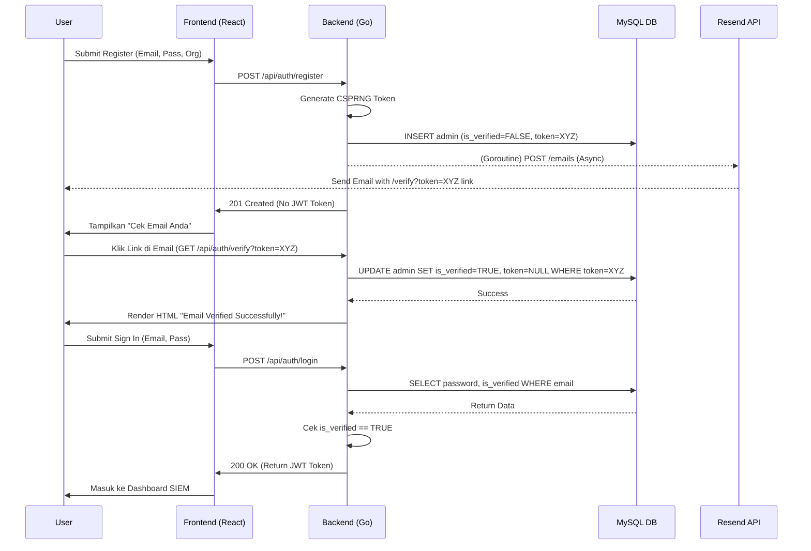

# Dokumentasi Sistem Verifikasi Email (Mini-SIEM)

## 1. Tujuan Fitur/Sistem
Fitur Verifikasi Email diimplementasikan untuk memastikan bahwa alamat email yang didaftarkan oleh pengguna baru benar-benar valid, aktif, dan dikendalikan penuh oleh pendaftar.
- **Masalah yang diselesaikan:** Mencegah pembuatan akun palsu (spam/bot), penyalahgunaan *resource*, dan menjaga kebersihan *database*. Hal ini sangat penting pada sistem SIEM karena email tersebut digunakan sebagai titik kontak utama untuk mengirimkan notifikasi peringatan keamanan dan ancaman kritis.

## 2. Alur Kerja Sistem (Workflow)
Sistem ini memodifikasi alur registrasi konvensional (yang sebelumnya otomatis *login*) menjadi alur berbasis validasi dua arah (Two-way validation).

**Flow End-to-End:**
1. **User Sign Up:** Pengguna mengisi formulir pendaftaran di Frontend (`SignInPage.tsx`) dan mengirimkan *request* `POST /api/auth/register`.
2. **Generate Token & Create Account:** Backend menerima request, melakukan *hashing* pada password, dan secara dinamis men-*generate* `verification_token` acak (32 karakter hex). Akun disimpan ke tabel `admins` dengan status `is_verified = 0`.
3. **Dispatch Email (Asynchronous):** Backend mengeksekusi Goroutine untuk memanggil API Resend.com. Layanan ini mengirimkan email selamat datang yang di dalamnya terdapat *magic link* verifikasi (`http://localhost:8081/api/auth/verify?token=XYZ`).
4. **Client Response:** Backend membalas Frontend dengan respons sukses (201) namun **tanpa** memberikan token otorisasi (JWT). UI Frontend bergeser ke state sukses dan menampilkan instruksi agar *user* mengecek kotak masuk emailnya.
5. **Verifikasi via Email:** User membuka email, mengklik tautan, yang memicu *HTTP GET request* dari *browser* ke endpoint backend `/api/auth/verify?token=XYZ`.
6. **Token Validation:** Backend mencari token tersebut di *database*. Jika ditemukan kecocokan, kolom `is_verified` diubah menjadi `1` dan `verification_token` dihapus (di-set menjadi `NULL`). Halaman HTML sukses dikembalikan ke *browser*.
7. **Login:** User kembali ke halaman aplikasi, lalu masuk (Sign In). Endpoint `POST /api/auth/login` akan mengecek status `is_verified`. Karena sudah `1`, sistem memvalidasi password dan memberikan JWT token agar *user* bisa mengakses Dashboard.



## 3. Detail Implementasi
Implementasi melibatkan penambahan skema, refaktor logika pendaftaran, dan penambahan handler verifikasi.

- **`database/database.go`**: Menambahkan kueri migrasi otomatis (`ALTER TABLE`) untuk menyuntikkan kolom `is_verified` dan `verification_token` ke dalam tabel `admins` yang sudah ada.
- **`handlers/register.go`**: 
  - Menghapus logika auto-login (pembuatan JWT token langsung).
  - Mengimplementasikan `crypto/rand` untuk membuat token verifikasi.
  - Memodifikasi kueri *Insert* ke *database*.
  - Mengirimkan token ke *helper* email melalui goroutineee.
- **`helpers/email.go`**: Mengubah *signature* fungsi `SendWelcomeEmail` untuk menerima parameter dinamis `verificationLink`. Menyesuaikan format `html` *payload* agar berbentuk tautan *clickable*.
- **`handlers/verify.go` (Baru)**: Bertugas memproses *HTTP GET request* murni, mengekstrak parameter `token` dari *query URL*, menjalankan *UPDATE database*, dan merender langsung *raw HTML* sebagai *response* antarmuka.
- **`handlers/login.go`**: Menyisipkan interseptor validasi. Mengekstrak nilai `is_verified` dari *database*, lalu mengembalikan *error HTTP 403 Forbidden* jika statusnya masih `FALSE`.
- **`frontend/src/components/SignInPage.tsx`**: Melakukan modifikasi blok logika saat fungsi *fetch* registrasi sukses (status 201). Alih-alih menulis JWT ke *localStorage*, sistem beralih ke *UI state* pesan instruksi verifikasi.

## 4. Penjelasan Logika Utama
- **CSPRNG Token Generation:** Dalam pembuatan token verifikasi, implementasi secara spesifik menggunakan *package* `crypto/rand` dari Go, bukan `math/rand`. Hal ini sangat kritikal, `crypto/rand` membaca entropi dari sistem operasi (CSPRNG), sehingga rentetan karakter heksadesimal yang dihasilkan tidak bisa ditebak (*unpredictable*).
- **Asynchronous Mail Dispatch:** Modul `helpers.SendWelcomeEmail` dijalankan di dalam *Goroutine* independen `go func(...) {...}()`. Jika API pihak ketiga (Resend) mengalami perlambatan (*latency spike*), *delay* tersebut tidak akan menunda respons HTTP ke *user*, sehingga UI aplikasi tetap terasa secepat kilat (*snappy*).
- **Atomic Verification:** Proses verifikasi token dan perubahan status akun dieksekusi secara *atomic* menggunakan skema klausa tunggal di SQL: `UPDATE admins SET is_verified = TRUE, verification_token = NULL WHERE verification_token = ?`. Skema ini sangat tangguh terhadap isu *Race Condition*.

## 5. API / Endpoint Contract

### POST `/api/auth/register`
Mendaftarkan akun admin baru (menunggu verifikasi).
- **Request Payload:**
  ```json
  { "organizationName": "PT Contoh", "email": "user@example.com", "password": "SecretPassword123!" }
  ```
- **Response (201 Created):**
  ```json
  {
    "success": true,
    "adminId": 12,
    "email": "user@example.com",
    "organizationId": 5,
    "organizationName": "PT Contoh",
    "message": "Please check your email to verify your account."
  }
  ```

### GET `/api/auth/verify`
Tautan *action* via email.
- **Query Parameter:** `token` (String, Required)
- **Response (200 OK):**
  Mengembalikan tipe konten `text/html`. Menampilkan halaman web *browser* statis dengan pesan: *Email Verified Successfully!*
- **Error Response (400 Bad Request / 405 Method Not Allowed):**
  Mengembalikan tipe konten `text/html`. Menampilkan halaman error seperti: *Invalid or expired token.*

### POST `/api/auth/login`
- **Request Payload:** `{ "email": "user@example.com", "password": "SecretPassword123!" }`
- **Error Response (403 Forbidden) - (Bila belum diverifikasi):**
  ```json
  { "success": false, "message": "Email belum diverifikasi. Silakan periksa kotak masuk email Anda." }
  ```

## 6. Database / Schema
Tabel target: `admins`

Perubahan skema (dieksekusi secara aman menggunakan `IF NOT EXISTS`):
- `is_verified` (`BOOLEAN DEFAULT FALSE`): Menandakan status keabsahan email (TRUE/FALSE).
- `verification_token` (`VARCHAR(255) DEFAULT NULL`): Menyimpan token sesi pendaftaran.

Catatan *Migration*: Akun *seed* sistem utama `admin@xrsecurity.com` diberikan pengecualian khusus saat *database bootstrap*, otomatis di-set ke `is_verified = TRUE`.

## 7. Cara Penggunaan & Pengujian
1. Konfigurasikan variabel `RESEND_API_KEY` di dalam *file* `.env` *backend*.
2. Mulai *backend* dan *frontend*. Buka `http://localhost:5173`.
3. Pindah ke *tab* pendaftaran ("Daftar") dan masukkan informasi organisasi dan email yang valid (contoh email Anda sendiri).
4. Klik daftar. Di antarmuka, Anda akan melihat pesan yang menyuruh Anda mengecek email.
5. Cobalah untuk *Sign In* dengan kredensial tersebut—sistem akan memblokirnya dengan *error warning* bahwa email belum diverifikasi.
6. Buka *inbox* (kotak masuk) email Anda, temukan email "Welcome to Mini-SIEM", klik tautan *"Verify Email"*.
7. Sebuah *tab* akan terbuka berisi teks "Email Verified Successfully!".
8. Kembali ke UI *frontend* dan cobalah *Sign In* kembali. Akses akan diizinkan dan Anda dialihkan ke Dashboard.

## 8. Edge Case & Validation
- **Pengecualian Testing/Development:** 
  Email *testing* default `"admin@xrsecurity.com"` memiliki pengecualian di *backend*. Pendaftaran dengan email tersebut akan memintas (*bypass*) goroutine pengiriman email eksternal (guna mencegah *spam* ke Resend selama *unit testing*).
- **Invalid / Expired Token:**
  Sistem menghitung angka `RowsAffected()` dari eksekusi *database*. Jika nilai tersebut adalah `0` (nol), berarti token tidak ada di dalam sistem. Backend otomatis me-render HTML: *"Invalid or expired token"*.
- **CORS Constraints:**
  Secara *default*, *browser* akan membuka *tab* baru saat tautan email diklik, mengirimkan GET *request* langsung. Metode penulisan HTML statis secara langsung lewat *response body backend* (`w.Write`) memastikan sistem tidak berbenturan dengan aturan pelaratan asal-silang (CORS).

## 9. Security Consideration
- **Replay Attack Prevention:** Penggunaan metode *(Nullification)* di mana nilai `verification_token` di-set menjadi `NULL` segera sesudah verifikasi berhasil. Tautan yang di-klik untuk yang kedua kalinya tidak akan berlaku lagi.
- **Data Encapsulation:** Selama status pengguna belum terverifikasi (`is_verified = FALSE`), JWT token **tidak pernah di-generate apalagi ditransmisikan** melintasi jaringan. Hal ini menegaskan *Zero-Trust Policy*, yang menutup akses API internal apa pun sebelum identitas kontak pengguna disahkan.
- **Sanitasi Kueri SQL:** Kueri verifikasi menggunakan model *Prepared Statement* (`database.DB.Exec("UPDATE ... WHERE verification_token = ?", token)`), guna menetralkan segala bentuk teknik vektor serangan SQL Injection yang dilewatkan lewat parameter URL *GET*.

## 10. Ringkasan Singkat Arsitektur (High-Level Overview)
Secara arsitektur, fitur ini mengikuti pola orkestrasi pemisahan *concerns*:
1. **Presentation Layer (React Frontend):** Berperan menangani interaksi murni pengguna, mengalihkan *state* form ke instruksi konfirmasi email, memutus ketergantungan pada injeksi JWT prematur.
2. **Routing & Delivery (Mux & Helpers):** Mewadahi titik masuk API dan memisahkan pekerjaan berat *3rd-party network calls* (Resend) ke *side-channel* (Goroutine) guna stabilitas performa.
3. **Business Logic & Controller (Handlers):** Bertindak sebagai jantung operasi, meramu validasi identitas, manajemen kriptografi token, dan keputusan kondisional akses (*blocking / unblocking* aliran masuk sesi JWT).
4. **Data Persistence (MySQL):** Menyediakan kepastian status final (*Source of Truth*) bergaransi skema ACID (*Atomicity, Consistency, Isolation, Durability*) dalam setiap transaksi verifikasi identitas.
